# EditorGameObject Refactor: Architecture Comparison

Visual comparison of the CURRENT system vs the NEW system after the refactor described in `editor-gameobject-refactor.md`. All diagrams reflect final design decisions from `editor-gameobject-refactor-review.md`.

---

## 1. Class Hierarchy

### BEFORE

`EditorGameObject` and `GameObject` are **unrelated classes** connected only by the `IGameObject` interface. `HierarchyItem` extends `IGameObject`, adding hierarchy-specific methods. `Component` references its owner via two fields: `IGameObject owner` and `GameObject gameObject`.

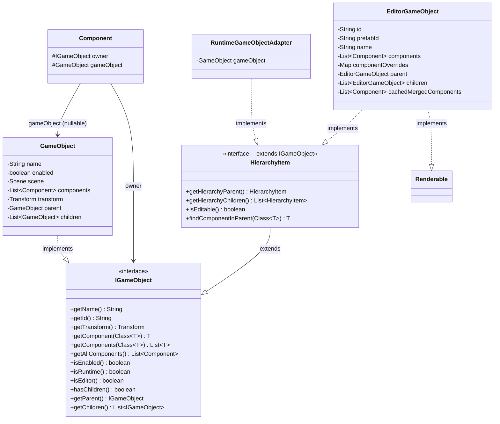

### AFTER

`EditorGameObject` **extends** `GameObject`. `IGameObject` is deleted. `HierarchyItem` is a standalone interface. `Component` has a single `gameObject` field. `EditorGameObject` no longer implements `Renderable` — rendering goes through `SpriteRenderer` components.

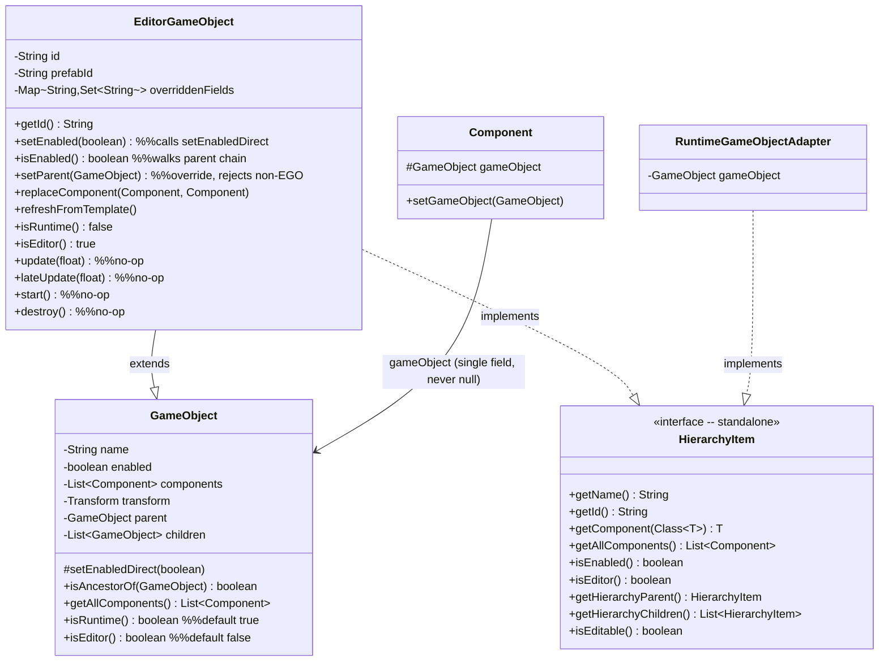

**Key changes from BEFORE:**
- `IGameObject` deleted entirely
- `Component` has one field (`gameObject`), not two — `setOwner(IGameObject)` becomes `setGameObject(GameObject)`
- `EditorGameObject` no longer implements `Renderable` (rendering goes through `SpriteRenderer` components)
- `EditorGameObject` overrides 4 lifecycle methods as no-ops (`update`, `lateUpdate`, `start`, `destroy`)
- `HierarchyItem` is standalone (not extending `IGameObject`), adds `isEditor()` method
- `GameObject` fields stay **private**; one protected helper (`setEnabledDirect`) for subclass access
- `GameObject.isAncestorOf()` made **public** (was private) — EGO deletes its own version, uses inherited
- `GameObject`'s unsafe generic no-arg `getComponents()` removed; replaced by `getAllComponents()`
- `EditorGameObject` adds `replaceComponent()` and `refreshFromTemplate()` methods
- `GameObject` no longer has a `scene` field (removed in Pre-work)
- No typed accessors (`getEditorChildren`/`getEditorParent`) — `getChildren()` returns `List<GameObject>`, ~5 sites cast inline

---

## 2. Component Ownership

### BEFORE

`Component.setOwner(IGameObject)` stores two references. The `gameObject` field is only set when the owner is a real `GameObject`. When `EditorGameObject` is the owner, `gameObject` is **null** -- causing failures in components that call `gameObject.getChildren()`.

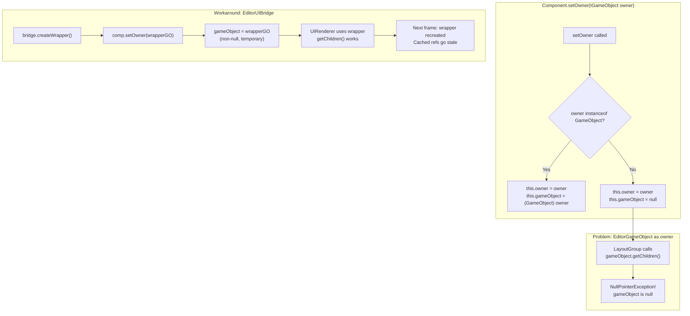

### AFTER

`Component.setGameObject(GameObject)` stores a single reference. Since `EditorGameObject IS-A GameObject`, the field is always non-null and always valid. No instanceof check needed.

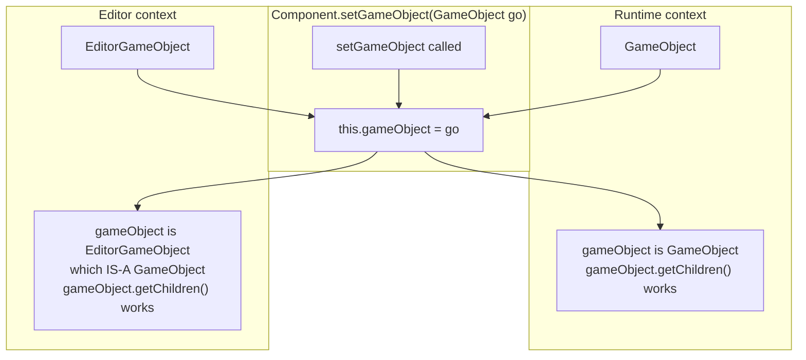

---

## 3. UI Rendering Flow

### BEFORE

`UIDesignerPanel` uses `EditorUIBridge` to create temporary `GameObject` wrappers. The bridge rebuilds wrappers on hierarchy changes, uses **reflection hacks** to bypass `GameObject` private fields, and temporarily reassigns component ownership.

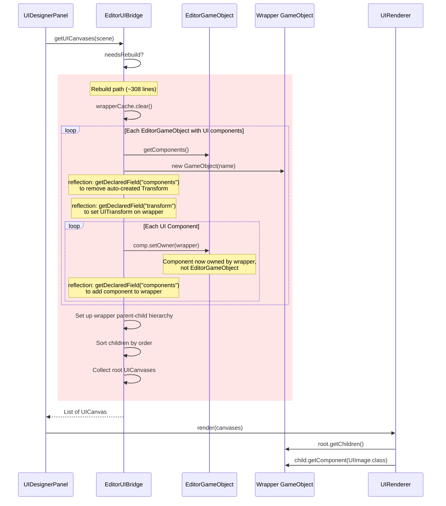

### AFTER

`UIDesignerPanel` collects `UICanvas` components directly from `EditorGameObject` entities and passes them to `UIRenderer`. No bridge, no wrappers, no reflection, no ownership reassignment. `EditorSceneRenderer` submits `SpriteRenderer` components (not `EditorGameObject` entities) for unified rendering with runtime.

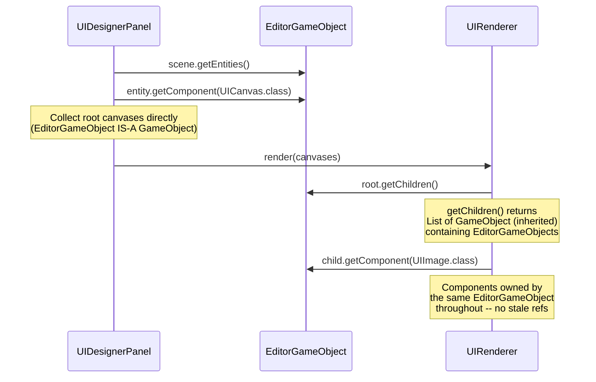

---

## 4. Prefab Instance Model

### BEFORE

Prefab instances store **no real components**. Field values live in a `Map<String, Map<String, Object>>` override map. Components are cloned from the prefab template **on demand** into a transient cache, which is invalidated on any change. Transform data is stored as raw `float[]` arrays in the override map.

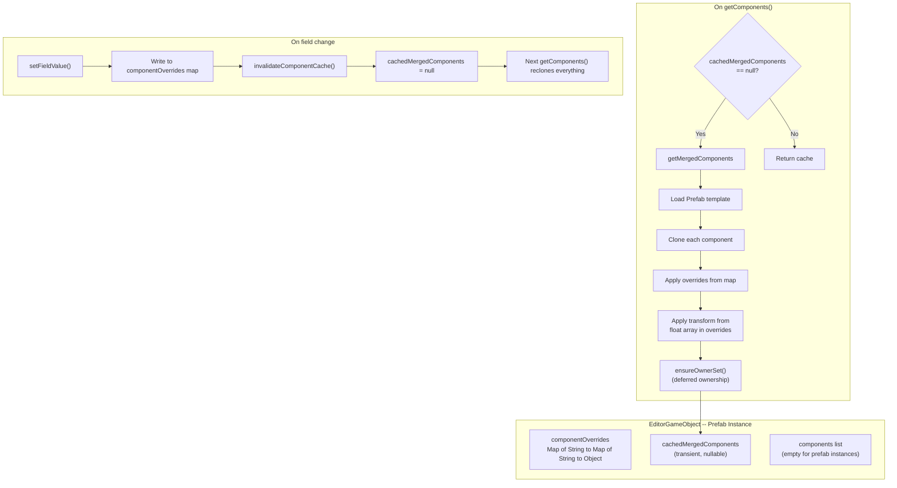

### AFTER

Prefab instances store **real component instances** (cloned at creation time) in the inherited `components` list. An `overriddenFields` Set tracks which fields the user explicitly changed. No caching, no invalidation, no deferred ownership.

```mermaid
flowchart TD
    subgraph "EditorGameObject -- Prefab Instance"
        A["components (inherited from GameObject)\nList of Component -- real instances"]
        B["overriddenFields\nMap of String to Set of String"]
    end

    subgraph "On creation / load"
        C["Clone components from prefab template"] --> D["Apply override values"]
        D --> E["Store in inherited components list"]
        E --> F["component.setGameObject(this) -- immediate"]
    end

    subgraph "On field change"
        G["Set field on real component"] --> H["Add field name to overriddenFields"]
    end

    subgraph "On save"
        I["Diff current values vs template defaults"] --> J["Write prefabId + overridden fields only"]
    end

    subgraph "On template save -- refreshFromTemplate()"
        K["Capture overridden field values"] --> L["Re-clone all components from updated template"]
        L --> M2["Re-apply captured overridden values"]
        M2 --> N2["Status bar: 'Refreshed N instances'"]
    end

    subgraph "Closed scenes"
        O2["Scene file stores prefabId + diffs only"] --> P2["On open: clones from latest template"]
        P2 --> Q2["Always up to date"]
    end
```

---

## 5. Scene Access

### BEFORE

`GameObject` holds a `Scene scene` back-reference set by `Scene.addGameObject()`. Components access scene systems via `gameObject.getScene()`. `EditorGameObject` has no `scene` field, so after inheritance it would inherit a null `scene` -- causing NPEs.

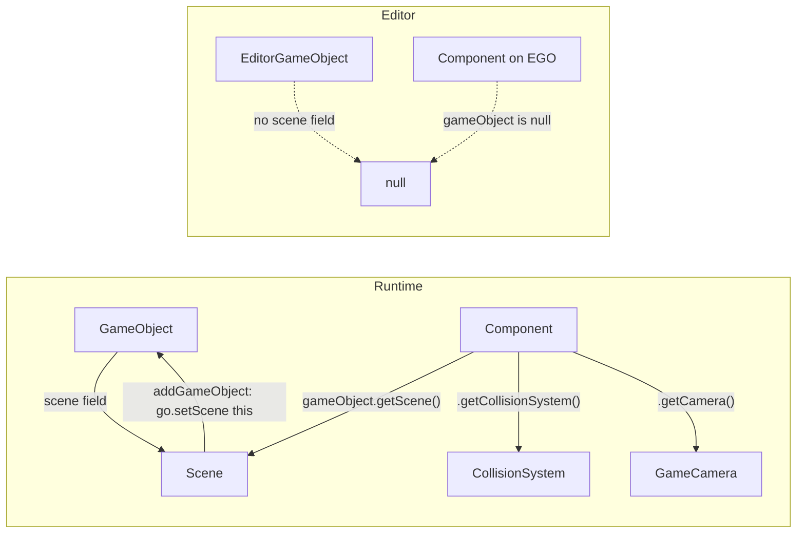

### AFTER

The `scene` field is removed from `GameObject` (Pre-work phase). Components use static `SceneManager.getCurrentScene()` for scene access. Works naturally for both runtime (scene exists) and editor (returns null, skipped gracefully).

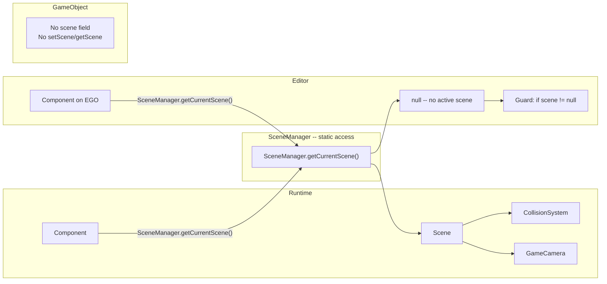

---

## 6. setEnabled() Flow

### BEFORE

`GameObject.setEnabled()` does three things: notifies components (`triggerEnable/triggerDisable`), invalidates Scene caches, and propagates to children. `EditorGameObject.setEnabled()` is a simple Lombok setter with no side effects. The two behaviors are incompatible -- the bridge's wrapper GameObjects may have stale enabled state.

```mermaid
flowchart TD
    subgraph "GameObject.setEnabled boolean"
        A[setEnabled called] --> B{enabled changed?}
        B -->|No| Z[Return early]
        B -->|Yes| C["this.enabled = enabled"]
        C --> D["Notify components\ntriggerEnable / triggerDisable"]
        D --> E{scene != null?}
        E -->|Yes| F["scene.registerCachedComponents\nor unregisterCachedComponents"]
        E -->|No| G[Skip]
        F --> H["Propagate to children\npropagateParentEnabledChange"]
        G --> H
        H --> I["Each child: notify components\n+ update scene caches\n+ recurse to grandchildren"]
    end

    subgraph "EditorGameObject.setEnabled boolean"
        J["Lombok @Setter"] --> K["this.enabled = enabled"]
        K --> L["No notifications\nNo cache updates\nNo propagation"]
    end

    subgraph "Bug: enabled state mismatch"
        M["EGO.setEnabled false"] --> N["Hierarchy panel sees: disabled"]
        M --> O["Bridge wrapper: still enabled\nuntil next rebuild"]
        N --> P["Visual mismatch"]
        O --> P
    end
```

### AFTER

`EditorGameObject` overrides `setEnabled()` with a simple field set (no component notifications, no scene caches -- editor does not need them). `GameObject.setEnabled()` uses `SceneManager.getCurrentScene()` instead of `this.scene` for cache registration. Since EGO IS-A GO, there is only one object -- no mismatch possible.

```mermaid
flowchart TD
    subgraph "GameObject.setEnabled boolean -- runtime"
        A[setEnabled called] --> B["this.enabled = enabled"]
        B --> C["Notify components"]
        C --> D{"SceneManager.getCurrentScene()\n!= null?"}
        D -->|Yes| E["Register/unregister caches"]
        D -->|No| F["Skip -- editor context"]
        E --> G["Propagate to children"]
        F --> G
    end

    subgraph "EditorGameObject.setEnabled boolean -- override"
        H[setEnabled called] --> I["setEnabledDirect(enabled)"]
        I --> J["Done -- no notifications\nno caches, no propagation"]
    end

    subgraph "isEnabled -- override"
        K["Check own enabled"] --> L{parent != null?}
        L -->|Yes| M["return parent.isEnabled()"]
        L -->|No| N["return true"]
    end

    subgraph "Single source of truth"
        O["UIRenderer reads EGO.isEnabled()"] --> P["Same object the hierarchy panel reads"]
        P --> Q["No mismatch possible"]
    end
```

---

## 7. Summary Table

| Metric | Before | After | Net Change |
|--------|--------|-------|------------|
| **Files deleted** | -- | `EditorUIBridge.java` (~308 lines), `IGameObject.java` (~125 lines) | **-433 lines** |
| **Files simplified** | -- | ~10+ files (Component, AlphaGroup, RenderDispatcher, UIDesignerPanel, etc.) | **~-200 lines** |
| **EGO internal reduction** | Reimplemented hierarchy, component mgmt, enabled state | Delegates to `super` for scratch entities | **~-300 lines** |
| **Prefab model** | `componentOverrides` map + `cachedMergedComponents` + `invalidateComponentCache()` + deferred ownership | Real components + `overriddenFields` Set | Simpler, fewer code paths |
| **Component owner fields** | 2 fields (`IGameObject owner`, `GameObject gameObject`) | 1 field (`GameObject gameObject`) | -1 field, -instanceof check |
| **Component setter** | `setOwner(IGameObject)` with instanceof dispatch | `setGameObject(GameObject)` — single assignment | Simpler, type-safe |
| **Reflection hacks** | 3 in EditorUIBridge (`getDeclaredField` for components, transform) | 0 | All removed |
| **`instanceof` dispatch** | 5+ checks (AlphaGroup, RenderDispatcher, Component.setOwner, etc.) | Most eliminated | Fewer type checks |
| **Stale cache bugs** | Wrapper recreation causes stale refs in UIScrollView, UIScrollbar | No wrappers, no stale refs | **4 HIGH + 2 MEDIUM bugs fixed** |
| **Scene access** | `gameObject.getScene()` back-reference | `SceneManager.getCurrentScene()` static | Decoupled, null-safe |
| **Hierarchy interfaces** | `IGameObject` (bridge) + `HierarchyItem extends IGameObject` | `HierarchyItem` standalone (with `isEditor()`) | Simpler contract |
| **Rendering** | EGO implements `Renderable`, RenderDispatcher has `instanceof` chain | EGO does NOT implement `Renderable`, EditorSceneRenderer submits `SpriteRenderer` components | Unified path |
| **Prefab auto-propagation** | Silent cache invalidation | Explicit `refreshFromTemplate()` on open scene; closed scenes auto-update on load | Clearer UX |
| **Protected helpers** | N/A (separate classes) | Private fields + 1 protected helper (`setEnabledDirect`) + `isAncestorOf()` made public | Minimal surface area |
| **Lifecycle safety** | EGO has no lifecycle methods | EGO overrides `update`, `lateUpdate`, `start`, `destroy` as no-ops | Prevents accidental component lifecycle |
| **Estimated total** | -- | ~930 lines deleted/simplified, ~100 new overrides | **Net ~-830 lines** |