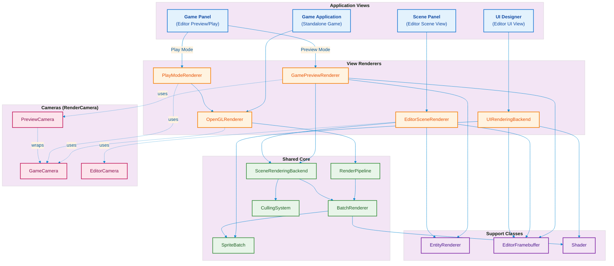

---

## Class Relationships Detailed

### RenderCamera Interface
```
┌─────────────────────────────────────────────────────────────┐
│                    <<interface>>                             │
│                     RenderCamera                             │
├─────────────────────────────────────────────────────────────┤
│ + getProjectionMatrix(): Matrix4f                           │
│ + getViewMatrix(): Matrix4f                                  │
│ + getWorldBounds(): float[]                                  │
│ + worldToScreen(x, y): Vector2f                              │
│ + screenToWorld(x, y): Vector3f                              │
└─────────────────────────────────────────────────────────────┘
                              △
                              │ implements
          ┌───────────────────┼───────────────────┐
          │                   │                   │
   ┌──────┴──────┐    ┌──────┴──────┐    ┌──────┴──────┐
   │  GameCamera  │    │ EditorCamera │    │PreviewCamera│
   │              │    │              │    │   wraps     │
   │ orthoSize    │    │ pixelsPerUnit│    │  GameCamera │
   │ ViewportCfg  │    │ zoom/pan     │    │             │
   └──────────────┘    └──────────────┘    └─────────────┘
```

### Rendering Flow by View

```
┌─────────────────────────────────────────────────────────────────────────────┐
│                            GAME APPLICATION                                  │
├─────────────────────────────────────────────────────────────────────────────┤
│                                                                              │
│   GameApplication                                                            │
│        │                                                                     │
│        ▼                                                                     │
│   OpenGLRenderer ──────► RenderPipeline ──────► BatchRenderer               │
│        │                      │                      │                       │
│        │                      ▼                      ▼                       │
│        │              CullingSystem            SpriteBatch                   │
│        │                      │                      │                       │
│        │                      └──────────┬───────────┘                       │
│        │                                 │                                   │
│        ▼                                 ▼                                   │
│   GameCamera ◄─────────────────── Scene.getRenderers()                      │
│                                                                              │
└─────────────────────────────────────────────────────────────────────────────┘

┌─────────────────────────────────────────────────────────────────────────────┐
│                         GAME PANEL (PLAY MODE)                               │
├─────────────────────────────────────────────────────────────────────────────┤
│                                                                              │
│   GameViewPanel                                                              │
│        │                                                                     │
│        ▼                                                                     │
│   PlayModeRenderer ──────► OpenGLRenderer ──────► RenderPipeline            │
│        │                                               │                     │
│        ▼                                               ▼                     │
│   RuntimeScene ◄──────────────────────────────── GameCamera                 │
│        │                                                                     │
│        ▼                                                                     │
│   EditorFramebuffer ──────► ImGui.image(textureId)                          │
│                                                                              │
└─────────────────────────────────────────────────────────────────────────────┘

┌─────────────────────────────────────────────────────────────────────────────┐
│                        GAME PANEL (PREVIEW MODE)                             │
├─────────────────────────────────────────────────────────────────────────────┤
│                                                                              │
│   GameViewPanel                                                              │
│        │                                                                     │
│        ▼                                                                     │
│   GamePreviewRenderer ──────► SceneRenderingBackend                         │
│        │                            │                                        │
│        │                            ├──► BatchRenderer ──► SpriteBatch      │
│        │                            └──► CullingSystem                       │
│        │                                                                     │
│        ├──► EntityRenderer                                                   │
│        │                                                                     │
│        ▼                                                                     │
│   PreviewCamera ─wraps─► GameCamera                                         │
│        │                                                                     │
│        ▼                                                                     │
│   EditorFramebuffer ──────► ImGui.image(textureId)                          │
│                                                                              │
└─────────────────────────────────────────────────────────────────────────────┘

┌─────────────────────────────────────────────────────────────────────────────┐
│                              SCENE PANEL                                     │
├─────────────────────────────────────────────────────────────────────────────┤
│                                                                              │
│   ScenePanel                                                                 │
│        │                                                                     │
│        ▼                                                                     │
│   EditorSceneRenderer ──────► SceneRenderingBackend                         │
│        │                            │                                        │
│        │                            ├──► BatchRenderer ──► SpriteBatch      │
│        │                            └──► CullingSystem                       │
│        │                                                                     │
│        ├──► EntityRenderer                                                   │
│        │                                                                     │
│        ▼                                                                     │
│   EditorCamera (free pan/zoom)                                              │
│        │                                                                     │
│        ▼                                                                     │
│   EditorFramebuffer ──────► ImGui.image(textureId)                          │
│                                                                              │
└─────────────────────────────────────────────────────────────────────────────┘

┌─────────────────────────────────────────────────────────────────────────────┐
│                              UI DESIGNER                                     │
├─────────────────────────────────────────────────────────────────────────────┤
│                                                                              │
│   UIDesignerPanel                                                            │
│        │                                                                     │
│        ▼                                                                     │
│   UIRenderingBackend ──────► SpriteBatch                                    │
│        │                                                                     │
│        │  (Screen-space coords: origin top-left, Y-down)                    │
│        │                                                                     │
│        ▼                                                                     │
│   EditorFramebuffer ──────► ImGui.image(textureId)                          │
│        │                                                                     │
│        │  Interaction: ImGui mouse events → Java hit testing                │
│        │                                                                     │
│        ▼                                                                     │
│   [Handles, Selection, Drag all via ImGui input + Java logic]               │
│                                                                              │
└─────────────────────────────────────────────────────────────────────────────┘
```

---

## Data Flow Summary

| View | Camera | Renderer | Backend | Output |
|------|--------|----------|---------|--------|
| **Game App** | GameCamera | OpenGLRenderer | RenderPipeline → BatchRenderer | Screen (default FBO) |
| **Game Panel (Play)** | GameCamera | PlayModeRenderer → OpenGLRenderer | RenderPipeline → BatchRenderer | EditorFramebuffer → ImGui |
| **Game Panel (Preview)** | PreviewCamera | GamePreviewRenderer | SceneRenderingBackend | EditorFramebuffer → ImGui |
| **Scene Panel** | EditorCamera | EditorSceneRenderer | SceneRenderingBackend | EditorFramebuffer → ImGui |
| **UI Designer** | None (screen-space) | UIRenderingBackend | SpriteBatch direct | EditorFramebuffer → ImGui |

---

## Key Design Decisions

### 1. SceneRenderingBackend as Shared Core
Both `EditorSceneRenderer` and `GamePreviewRenderer` use `SceneRenderingBackend` which owns:
- `BatchRenderer` → `SpriteBatch` for drawing
- `CullingSystem` for frustum culling

This eliminates duplicate tilemap rendering logic.

### 2. RenderCamera Interface
All cameras implement `RenderCamera`:
- `GameCamera` - runtime, uses `orthographicSize` + `ViewportConfig`
- `EditorCamera` - editor scene view, uses `pixelsPerUnit` + free pan/zoom
- `PreviewCamera` - wraps `GameCamera` to ensure preview matches runtime

### 3. PreviewCamera Wraps GameCamera
Ensures preview mode uses **identical math** to runtime:
```java
public class PreviewCamera implements RenderCamera {
    private final GameCamera camera;  // Same math as runtime
    
    public void applySceneSettings(Vector2f pos, float orthoSize) {
        camera.setPosition(pos.x, pos.y);
        camera.setOrthographicSize(orthoSize);
    }
}
```

### 4. UIRenderingBackend Uses Screen-Space
UI Designer uses screen-space coordinates (Y-down) matching the UI system:
```java
projectionMatrix.ortho(0, width, height, 0, -1000, 1000);  // Y-down
```

### 5. EntityRenderer is Stateless
`EntityRenderer` receives `SpriteBatch` from caller:
```java
entityRenderer.render(backend.getSpriteBatch(), scene);
```
No state, easily shared across renderers.
